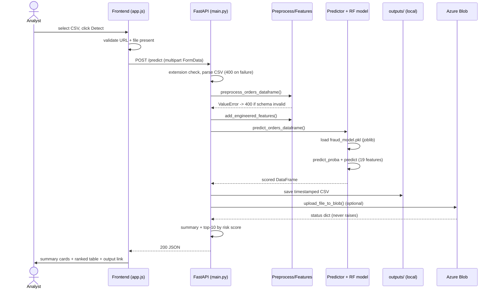
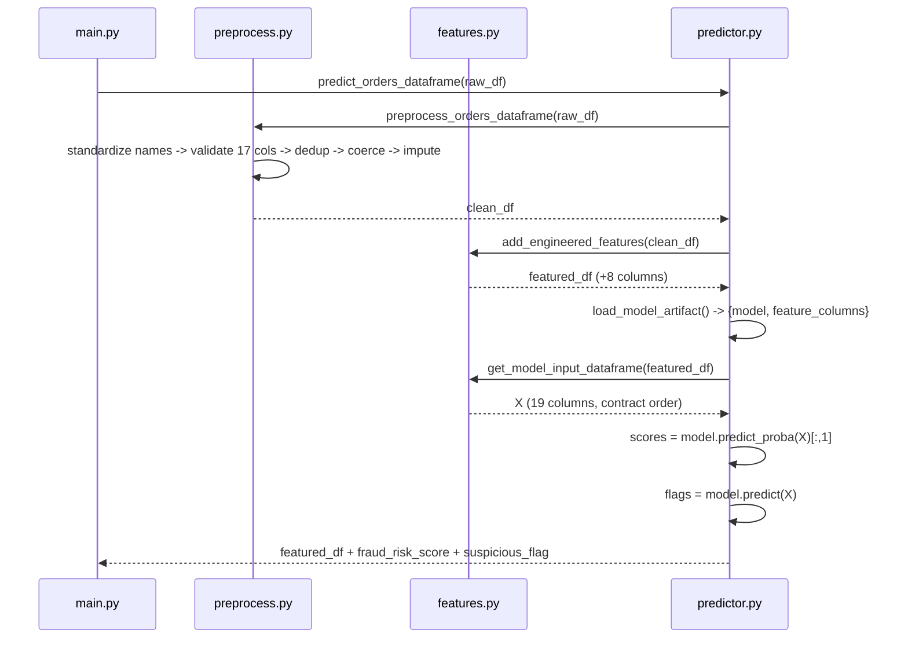
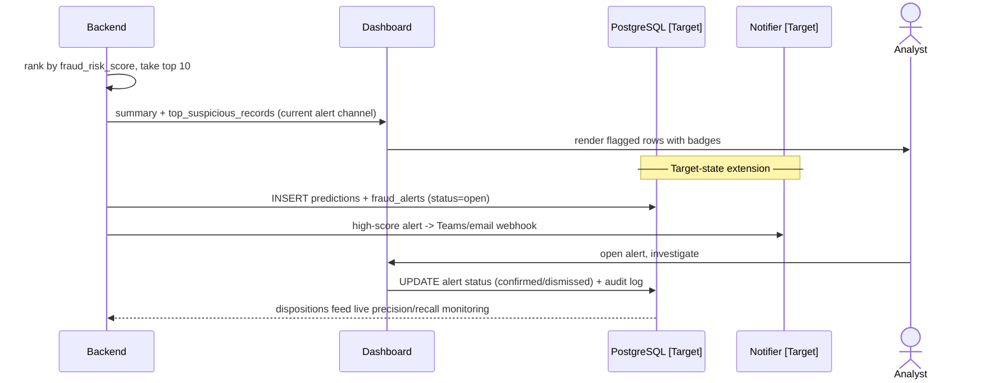

# Solution Document

## AI-Based Fraud and Abnormal Order Detection System for Supply Chain ERP Transactions

| | |
|---|---|
| **Document type** | Solution Architecture & Technical Design Document |
| **System** | Supply Chain Fraud Detection Platform |
| **Version** | 1.0 |
| **Date** | June 2026 |
| **Audience** | Solution architects, AI/ML engineers, developers, technical leads, business stakeholders |
| **Status convention** | Sections describe the **implemented system** unless explicitly marked **[Target State]**, which denotes the recommended production design not yet built |

---

# 1. Executive Summary

## 1.1 Purpose of the Solution

The Supply Chain Fraud Detection Platform is an AI-powered system that identifies fraudulent and abnormal orders inside ERP-style supply chain transaction data. A user uploads a CSV file of order transactions through a web interface; the platform cleans the data, derives fraud-relevant business features, scores every transaction with a trained machine learning model, and returns a per-record **fraud risk score** (probability between 0 and 1) and a binary **suspicious flag**, together with a summary and the top suspicious records. Prediction outputs are persisted locally and, optionally, to Azure Blob Storage for cloud deployments.

## 1.2 Business Problem Being Solved

ERP and supply chain systems process thousands of orders, refunds, returns, and shipments daily. Fraudulent behaviour — refund abuse, discount abuse, reshipping fraud, account-takeover purchases — hides inside records that individually look legitimate. Manual review is:

- **Slow** — analysts cannot inspect every transaction.
- **Inconsistent** — different reviewers apply different judgment.
- **Unscalable** — review effort grows linearly with transaction volume.

The platform converts this manual triage problem into an automated screening problem: every transaction receives a machine-generated risk score so that human attention is concentrated on the small fraction of records most likely to be fraudulent.

## 1.3 Key Objectives

1. Ingest ERP order data via CSV upload with strict schema validation.
2. Engineer explainable, business-interpretable fraud features.
3. Score transactions with a supervised ML model (Random Forest baseline).
4. Expose the capability as a REST API (FastAPI) consumable by a browser frontend.
5. Run identically on a local machine and on Azure App Service.
6. Optionally persist prediction outputs to Azure Blob Storage, with all secrets confined to the backend.

## 1.4 Expected Benefits

| Benefit | Mechanism |
|---|---|
| Reduced analyst workload | Analysts review only flagged/top-ranked records instead of all transactions |
| Faster fraud response | Batch scoring of 1,000 records completes in seconds |
| Explainability | Features map directly to business concepts (shipping mismatch, refund ratio, discount abuse) |
| Low operating cost | Lightweight stack; cloud components optional |
| Deployment flexibility | Same codebase runs locally and on Azure without modification |

## 1.5 High-Level Architecture Overview

```
┌─────────────┐   CSV upload    ┌──────────────────────────────────────┐
│  Browser UI │ ──────────────► │       FastAPI Backend (app/)         │
│ (HTML/CSS/  │                 │  ┌───────────┐  ┌─────────────────┐  │
│  JS, static)│ ◄────────────── │  │Preprocess │─►│Feature Engineer │  │
└─────────────┘  JSON results   │  └───────────┘  └────────┬────────┘  │
                                │                          ▼           │
                                │  ┌───────────┐  ┌─────────────────┐  │
                                │  │ Save CSV  │◄─│ Random Forest    │  │
                                │  │ outputs/  │  │ (joblib .pkl)    │  │
                                │  └─────┬─────┘  └─────────────────┘  │
                                └────────┼─────────────────────────────┘
                                         │ optional (env-configured)
                                         ▼
                                ┌─────────────────────┐
                                │ Azure Blob Storage   │
                                │ container: outputs   │
                                └─────────────────────┘
```

The system is a **synchronous batch-scoring pipeline**: one HTTP request carries the full dataset, and the response carries the full result. There is no database, queue, or session state in the current implementation — by design, to keep the system simple, portable, and reproducible.

---

# 2. Business Requirements

## 2.1 Fraud Scenarios Addressed

The system targets ERP **order-level** fraud and abnormality patterns:

1. **Reshipping / drop-address fraud** — billing state differs from shipping state.
2. **Discount abuse** — abnormally high discounts (≥ 25%).
3. **New-account high-value fraud** — accounts younger than 60 days placing orders above ₹/$5,000.
4. **Refund abuse** — refund amount disproportionate to order amount.
5. **Serial-returner behaviour** — high lifetime return-to-order ratio per customer.
6. **Process-override abuse** — urgent shipping combined with a manual override of standard workflow.
7. **Odd-hour ordering** — orders placed between 23:00 and 05:00.
8. **Outlier order values** — order amounts above 7,000.

## 2.2 Types of Fraud Detected

- **Supervised fraud classification**: the model is trained on a labelled `fraud_label` column and outputs a calibrated-ish probability (`fraud_risk_score`).
- **Abnormal-order screening**: records that are not confirmed fraud but deviate from expected behaviour surface near the top of the ranked output even when below the binary threshold.

## 2.3 Functional Requirements

| ID | Requirement | Status |
|---|---|---|
| FR-1 | Accept CSV file upload of order transactions | Implemented (`POST /predict`) |
| FR-2 | Validate the presence of 17 required schema columns | Implemented (`preprocess.py`) |
| FR-3 | Clean data: deduplicate, coerce types, impute missing values | Implemented |
| FR-4 | Derive 8 engineered fraud features per record | Implemented (`features.py`) |
| FR-5 | Score every record with the trained model | Implemented (`predictor.py`) |
| FR-6 | Return summary statistics and top-10 suspicious records | Implemented |
| FR-7 | Persist full scored output as CSV | Implemented (`outputs/`) |
| FR-8 | Optionally upload output CSV to Azure Blob Storage | Implemented (`storage.py`) |
| FR-9 | Provide a health endpoint for liveness checking | Implemented (`GET /health`) |
| FR-10 | Display results in a browser UI with risk badges | Implemented (`frontend/`) |

## 2.4 Non-Functional Requirements

| ID | Requirement | Current state |
|---|---|---|
| NFR-1 | Explainability: features must be business-interpretable | Met — all features map to named business rules |
| NFR-2 | Portability: run locally and on Azure with no code change | Met — import fallbacks + env-driven config |
| NFR-3 | Security: no secrets in frontend or source code | Met — connection string via env var only |
| NFR-4 | Resilience: cloud failures must not break local operation | Met — Blob upload degrades gracefully to local path |
| NFR-5 | Authentication / RBAC | **[Target State]** — not implemented |
| NFR-6 | Audit trail / persistent logging | **[Target State]** — not implemented |

## 2.5 Performance Expectations

- Batch of 1,000 records: end-to-end `/predict` response in low single-digit seconds on commodity hardware (dominated by pandas processing and model inference; the Random Forest with 200 trees scores 1,000 rows in well under a second).
- Stateless request handling — every request is independent; no warm-up beyond model load.
- **Known inefficiency**: the model artifact is re-loaded from disk on every request (`load_model_artifact()` is called inside `predict_orders_dataframe`). Acceptable at current scale; should be cached at startup for production (see §19).

## 2.6 Accuracy Targets and Current Results

| Metric | Current (synthetic test set) | Target |
|---|---|---|
| ROC-AUC | **0.9331** | ≥ 0.93 (maintain) |
| Accuracy | 0.9050 | informative only (imbalanced data) |
| Precision | 0.5000 | ≥ 0.60 |
| Recall | **0.0526** | **≥ 0.70 (primary improvement goal)** |
| F1-score | 0.0952 | ≥ 0.65 |

The ranking quality (AUC) is strong; the binary classification at the default 0.5 threshold is weak. Recall improvement via threshold tuning and imbalance handling is the highest-priority open work item.

## 2.7 Scalability Requirements

- Current scope: departmental/batch usage — files up to tens of thousands of rows per upload.
- The stateless API design permits horizontal scaling behind a load balancer with zero code change (no shared state other than the read-only model file and the output folder).
- **[Target State]** for enterprise volume: see §16 (caching, batch workers, autoscaling).

---

# 3. Solution Architecture

## 3.1 Component Inventory

| # | Component | Artifact | Responsibility |
|---|---|---|---|
| 1 | **User Interface** | `frontend/index.html`, `app.js`, `styles.css` | CSV selection, API URL configuration, result rendering |
| 2 | **API Layer** | `app/main.py` | HTTP endpoints, CORS, request validation, error mapping, response assembly |
| 3 | **Preprocessing Service** | `app/services/preprocess.py` | Column standardization, schema validation, dedup, type coercion, imputation |
| 4 | **Feature Engineering Service** | `app/services/features.py` | Derivation of 8 fraud features; definition of the 19-column model input contract |
| 5 | **Prediction Service (AI/ML engine)** | `app/services/predictor.py` + `models/fraud_model.pkl` | Model loading, inference, result assembly, output persistence, summary building |
| 6 | **Storage Service** | `app/services/storage.py` | Optional Azure Blob upload with graceful degradation |
| 7 | **Training Pipeline** | `scripts/train_baseline.py` | Offline model training, evaluation, artifact serialization |
| 8 | **Data Generator** | `scripts/generate_sample_data.py` | Synthetic labelled ERP dataset creation |
| 9 | **File Store (local)** | `data/`, `outputs/`, `models/` | Raw/processed data, prediction outputs, model artifact |
| 10 | **File Store (cloud)** | Azure Blob container `outputs` | Persistent cloud copy of prediction outputs |
| 11 | **Database** | — | **[Target State]** — none in current build (see §7) |
| 12 | **Monitoring** | — | **[Target State]** — uvicorn console logs only (see §15) |

## 3.2 End-to-End Data Flow

```
User selects CSV ──► Browser builds multipart FormData
                          │
                          ▼
              POST {API_URL}/predict  (multipart/form-data)
                          │
                          ▼
        main.py: filename + extension validation (400 on failure)
                          │
                          ▼
        pandas.read_csv(BytesIO(file_bytes))  (400 on parse failure)
                          │
                          ▼
   predictor.predict_orders_dataframe(df)
        │ 1. preprocess_orders_dataframe(df)      ── schema check, clean, impute
        │ 2. add_engineered_features(df)          ── +8 derived columns
        │ 3. load_model_artifact()                ── joblib load fraud_model.pkl
        │ 4. get_model_input_dataframe(df)        ── select 19 feature columns
        │ 5. model.predict_proba / model.predict  ── score + label
        ▼
   result df  (+fraud_risk_score, +suspicious_flag)
        │
        ├──► save_prediction_results()  ──► outputs/{name}_predictions_{ts}.csv
        │
        ├──► upload_file_to_blob()      ──► Azure Blob (if env configured) → status dict
        │
        ├──► build_prediction_summary() ──► {total_rows, suspicious_rows, avg_score}
        │
        └──► sort by fraud_risk_score desc → head(10) → records
                          │
                          ▼
          JSON response → browser renders summary cards + results table
```

## 3.3 Request–Response Sequence

1. The browser submits `FormData` containing one CSV file to `POST /predict`.
2. The API rejects requests with no filename or a non-`.csv` extension (HTTP 400).
3. File bytes are parsed into a pandas DataFrame; parse errors return HTTP 400 with the parser message.
4. The prediction service runs the three-stage pipeline (clean → feature → score). A missing model artifact maps to HTTP 500; a schema validation failure (`ValueError`) maps to HTTP 400; any other failure maps to HTTP 500.
5. The scored DataFrame is written to `outputs/` with a timestamped filename derived from the upload's stem.
6. The Blob upload is attempted; its outcome (success, not-configured, or error) is captured as a status dictionary — **never** as an exception that fails the request.
7. The response combines: message, original filename, local output path, blob upload status, summary statistics, and the top 10 records by risk score.
8. The frontend renders the summary, shows the blob URL if present (falling back to the local path), and populates the results table with Yes/No badges for the flag columns.

## 3.4 Integration Points

| Integration | Direction | Protocol | Contract |
|---|---|---|---|
| Frontend → Backend | outbound | HTTP/JSON over `fetch` | `POST /predict` multipart; JSON response |
| Backend → Azure Blob Storage | outbound | Azure Storage SDK (HTTPS) | Connection string from `AZURE_STORAGE_CONNECTION_STRING`; container `outputs`; `upload_blob(overwrite=True)` |
| Backend → Model artifact | local file | joblib | dict `{"model": RandomForestClassifier, "feature_columns": [...]}` |
| Training → Serving | offline file handoff | `models/fraud_model.pkl` | Same feature-column contract enforced by `MODEL_FEATURE_COLUMNS` |

CORS is currently open (`allow_origins=["*"]`) to simplify development; production should restrict it to the deployed frontend origin (§13).

---

# 4. Technology Stack

| Layer | Technology Used | Purpose |
|---|---|---|
| Frontend | HTML5, CSS3, vanilla JavaScript (ES2020) | CSV upload UI, result rendering — no framework by design |
| Backend | Python 3.11+, FastAPI | HTTP service hosting the inference pipeline |
| API Layer | FastAPI + Starlette, `python-multipart` | REST endpoint definition, multipart upload parsing, automatic OpenAPI docs at `/docs` |
| App Server | Uvicorn (dev), Gunicorn + UvicornWorker (Azure) | ASGI serving locally and in App Service |
| AI Framework | scikit-learn | RandomForestClassifier, metrics, train/test split |
| Model Training | `scripts/train_baseline.py` (scikit-learn + joblib) | Offline training, evaluation, artifact serialization |
| Data Processing | pandas, NumPy | CSV parsing, cleaning, feature engineering, vectorized scoring |
| Database | None (file-based: CSV + joblib) — **[Target State: PostgreSQL]** | Current design is a stateless batch pipeline |
| Authentication | None — **[Target State: Azure AD / JWT]** | Out of current academic scope |
| Message Queue | None — **[Target State: Azure Service Bus / Kafka]** | Synchronous request/response suffices at current scale |
| Cloud Storage | Azure Blob Storage (`azure-storage-blob` SDK) | Optional persistent storage of prediction outputs |
| Deployment Platform | Local (uvicorn) and Azure App Service (gunicorn) | Dual-mode deployment |
| Monitoring | Console/uvicorn logs — **[Target State: App Insights]** | Liveness via `GET /health` |

## 4.1 Why Each Technology Was Chosen

- **FastAPI** — minimal boilerplate for ML inference APIs, native async upload handling, automatic interactive documentation (`/docs`), first-class type hints. Flask would need extra libraries for the same; Django is too heavy for a two-endpoint service.
- **Vanilla HTML/CSS/JS frontend** — the UI has exactly one workflow (upload → view results). A React/Angular build chain would add tooling cost with no functional gain. The static site is servable by `python -m http.server` or any static host.
- **scikit-learn Random Forest** — strong baseline for structured tabular data; handles mixed-scale numeric features without normalization; provides `predict_proba` for risk scoring and `feature_importances_` for explainability; trivially serializable with joblib.
- **pandas/NumPy** — de-facto standard for tabular ETL in Python; the entire feature pipeline is vectorized (no Python-level row loops).
- **joblib** — efficient serialization of scikit-learn estimators (handles the NumPy arrays inside the trees better than raw pickle).
- **Azure Blob Storage** — cheap, simple object storage matching the file-based output design; the SDK is the only cloud dependency, and the integration is optional at runtime.
- **Gunicorn + UvicornWorker on App Service** — production-grade process management on Linux App Service while keeping the same ASGI app object (`app.main:app`).

---

# 5. Frontend Design

## 5.1 User Interface Technology

The frontend is deliberately framework-free: three static files.

- `index.html` — single-page layout: API URL field, file input, submit button, status box, hidden results section.
- `styles.css` — visual styling, status box states, Yes/No flag badges.
- `app.js` — all behaviour: form handling, `fetch` call, response rendering.

This choice is intentional (see §4.1). For an enterprise multi-screen build-out, a framework would be justified — that design is described as **[Target State]** below.

## 5.2 Screens

### 5.2.1 Results Dashboard (Implemented)

After a successful upload, the page displays:

- **Summary cards**: total rows processed, suspicious row count, average risk score among suspicious rows.
- **Output location**: the Azure Blob URL when the upload succeeded, otherwise the local output file path.
- **Top suspicious transactions table** (10 rows, ranked by `fraud_risk_score` descending):

| Column | Rendering |
|---|---|
| Order ID, Customer ID | text |
| Order amount | 2-decimal number |
| Fraud risk score | 4-decimal number |
| Suspicious flag | green/red Yes/No badge |
| Shipping mismatch flag | Yes/No badge |
| High discount flag | Yes/No badge |

### 5.2.2 Investigation Screen — [Target State]

A per-transaction drill-down showing: customer profile (account age, order count, return count), the full transaction record, the model's risk score with a confidence band, the per-record top contributing features (via SHAP, §19), and prior alerts for the same customer.

### 5.2.3 Analytics Dashboard — [Target State]

Aggregate views over scored history: fraud-rate trend over time, top high-risk customers, fraud category mix (which engineered flags fire most often), precision/recall KPIs against analyst-confirmed outcomes. Requires the persistence layer of §7 [Target State].

## 5.3 State Management

There is no client-side state store; the application is a single transient workflow. State lives in the DOM:

- `statusBox` carries the four UI states via CSS classes: idle, `status-loading`, `status-success`, `status-error`.
- `resultsSection` is toggled via the `hidden` class only after a successful response.
- The submit button is disabled during the request (`submitButton.disabled = true` in a `try/finally`), preventing duplicate submissions.

## 5.4 API Integration

- The backend base URL is user-editable (`api-url` input, default `http://127.0.0.1:8000`) and normalized by trimming a trailing slash — this is how the same static frontend points at either a local or an Azure-hosted backend.
- The CSV is sent as `multipart/form-data` via `FormData`; the browser sets the content-type boundary automatically.
- Responses are parsed as JSON; non-OK responses surface the FastAPI `detail` field as the error message.
- Optional chaining (`responseData.blob_upload?.blob_url`) makes the blob URL safely optional.

## 5.5 Error Handling

| Failure | UX behaviour |
|---|---|
| Empty API URL or no file selected | Inline validation message before any network call |
| Network failure / CORS / server down | `fetch` rejection → red status box with the error message |
| HTTP 4xx/5xx from backend | Backend `detail` string displayed verbatim |
| Malformed numeric fields in response | `formatNumber`/`formatDecimal` coerce null/NaN to safe defaults |
| Empty suspicious list | Explicit "No suspicious rows were returned" table row |

## 5.6 Security Measures

- **No secrets in the frontend** — the Azure connection string never reaches the browser; the frontend only ever sees the resulting blob URL.
- The frontend performs no authentication (none exists yet — §13).
- **Known gap**: table cells are built via `innerHTML` with values from the response, which originate from the uploaded CSV. A CSV containing HTML/script fragments in `order_id`/`customer_id` could inject markup into the page (self-XSS in the current single-user model, a real stored-XSS risk in a multi-user [Target State]). Recommended fix: build cells with `textContent`/`createElement` instead of string interpolation.

---

# 6. Backend Architecture

## 6.1 API Layer

Two endpoints, defined in `app/main.py`:

| Method | Path | Purpose |
|---|---|---|
| GET | `/health` | Liveness check |
| POST | `/predict` | Upload CSV → scored results |

Full payload documentation is in §11. Cross-cutting concerns:

- **CORS middleware** allows browser calls from any origin (development setting).
- **Import fallback**: `app/main.py` and `predictor.py` first try `from app.services...` and fall back to `from services...`. This is intentional — Azure App Service may start the process from inside the `app/` folder (`--chdir app`), changing the import root. Do not "clean up" this pattern.
- **Error mapping policy**: client mistakes (bad file, bad schema) → 400; server-side problems (missing model, inference crash) → 500; cloud-storage problems → **not an error at all**, just a status field in a 200 response.

## 6.2 Business Logic Pipeline

The pipeline is a pure function chain over pandas DataFrames:

1. **Validation** (`preprocess.validate_required_columns`) — all 17 raw columns must be present after name standardization; otherwise `ValueError` listing exactly which columns are missing.
2. **Data preprocessing** (`preprocess.preprocess_orders_dataframe`) — standardize column names (lowercase, trimmed, underscored), deduplicate rows, coerce 12 numeric columns with `errors="coerce"`, impute numeric NaNs with the column median (0 if the whole column is empty) and text NaNs with `"unknown"`.
3. **Feature engineering** (`features.add_engineered_features`) — adds the 8 derived fraud signals (§8.3).
4. **Model invocation** (`predictor.predict_orders_dataframe`) — loads the artifact, selects the 19-column model input in contract order, runs `predict_proba` (risk score, rounded to 4 dp) and `predict` (binary flag).
5. **Prediction generation** — the scored DataFrame retains every input and engineered column plus the two new output columns, so the saved CSV is fully self-describing.

## 6.3 Service Layer

The current codebase maps onto the canonical fraud-platform service decomposition as follows:

| Canonical service | Current implementation | Notes |
|---|---|---|
| Transaction service | `preprocess.py` | Ingestion hygiene and schema contract |
| Fraud scoring service | `features.py` + `predictor.py` | The AI core |
| Alert service | Response payload (`top_suspicious_records`) | **[Target State]**: persistent alerts with status workflow (§7) |
| Audit service | Timestamped output CSVs in `outputs/` | **[Target State]**: structured audit log table (§7, §13) |
| Storage service | `storage.py` | Cloud persistence with graceful degradation |

## 6.4 Prediction Workflow (textual sequence)

```
Client          main.py            predictor.py        preprocess/features      storage.py        Azure Blob
  │  POST /predict  │                    │                      │                    │                 │
  ├────────────────►│                    │                      │                    │                 │
  │                 │ validate name/ext  │                      │                    │                 │
  │                 │ parse CSV          │                      │                    │                 │
  │                 ├───────────────────►│                      │                    │                 │
  │                 │                    │ preprocess ─────────►│ clean/validate     │                 │
  │                 │                    │ add features ───────►│ +8 columns         │                 │
  │                 │                    │ load model (joblib)  │                    │                 │
  │                 │                    │ predict_proba/predict│                    │                 │
  │                 │◄───────────────────┤ scored DataFrame     │                    │                 │
  │                 │ save CSV → outputs/│                      │                    │                 │
  │                 ├────────────────────┼──────────────────────┼───────────────────►│ upload_blob ───►│
  │                 │◄───────────────────┼──────────────────────┼────────────────────┤ status dict     │
  │                 │ build summary, sort top-10                │                    │                 │
  │◄────────────────┤ JSON response      │                      │                    │                 │
```

---

# 7. Database Design

## 7.1 Current Implementation: File-Based Persistence

The current system **intentionally has no database**. Persistence is file-based:

| Store | Location | Content |
|---|---|---|
| Raw data | `data/raw/orders.csv` | Synthetic labelled training data |
| Processed data | `data/processed/orders_cleaned.csv`, `orders_featured.csv` | Training-pipeline intermediates |
| Model artifact | `models/fraud_model.pkl` | `{"model": ..., "feature_columns": [...]}` |
| Prediction outputs | `outputs/{stem}_predictions_{YYYYMMDD_HHMMSS}.csv` | Full scored result per upload |
| Cloud copy | Azure Blob container `outputs` | Same CSV, uploaded when configured |

This is the right call for the current scope (single-user batch screening, no inter-request state) — do not introduce a database merely to replicate this design.

## 7.2 [Target State] Relational Schema — PostgreSQL

When the platform evolves to multi-user investigation workflows (alert triage, audit, analytics), PostgreSQL is the recommended store (mature, strong JSON support for payload archival, window functions for behavioural features). Proposed schema:

```sql
CREATE TABLE customers (
    customer_id      VARCHAR(20) PRIMARY KEY,        -- e.g. CUST0042
    account_created  DATE        NOT NULL,
    order_count      INTEGER     NOT NULL DEFAULT 0,
    return_count     INTEGER     NOT NULL DEFAULT 0,
    risk_tier        VARCHAR(10) NOT NULL DEFAULT 'normal'
);

CREATE TABLE transactions (
    order_id              VARCHAR(20) PRIMARY KEY,   -- e.g. ORD000123
    customer_id           VARCHAR(20) NOT NULL REFERENCES customers(customer_id),
    product_id            VARCHAR(20) NOT NULL,
    order_amount          NUMERIC(12,2) NOT NULL,
    quantity              INTEGER NOT NULL,
    discount_percent      NUMERIC(5,2) NOT NULL,
    billing_state         VARCHAR(40),
    shipping_state        VARCHAR(40),
    refund_amount         NUMERIC(12,2) NOT NULL DEFAULT 0,
    return_flag           BOOLEAN NOT NULL DEFAULT FALSE,
    urgent_shipping_flag  BOOLEAN NOT NULL DEFAULT FALSE,
    manual_override_flag  BOOLEAN NOT NULL DEFAULT FALSE,
    order_ts              TIMESTAMPTZ NOT NULL
);

CREATE TABLE predictions (
    prediction_id    BIGSERIAL PRIMARY KEY,
    order_id         VARCHAR(20) NOT NULL REFERENCES transactions(order_id),
    model_version    VARCHAR(40) NOT NULL,           -- ties score to artifact
    fraud_risk_score NUMERIC(6,4) NOT NULL,
    suspicious_flag  BOOLEAN NOT NULL,
    feature_snapshot JSONB,                          -- engineered features at scoring time
    scored_at        TIMESTAMPTZ NOT NULL DEFAULT now()
);

CREATE TABLE fraud_alerts (
    alert_id      BIGSERIAL PRIMARY KEY,
    prediction_id BIGINT NOT NULL REFERENCES predictions(prediction_id),
    status        VARCHAR(20) NOT NULL DEFAULT 'open',  -- open|investigating|confirmed|dismissed
    assigned_to   BIGINT REFERENCES users(user_id),
    resolution    TEXT,
    created_at    TIMESTAMPTZ NOT NULL DEFAULT now(),
    resolved_at   TIMESTAMPTZ
);

CREATE TABLE users (
    user_id       BIGSERIAL PRIMARY KEY,
    username      VARCHAR(60) UNIQUE NOT NULL,
    role          VARCHAR(20) NOT NULL,               -- analyst|lead|admin
    email         VARCHAR(120) UNIQUE NOT NULL
);

CREATE TABLE audit_logs (
    log_id     BIGSERIAL PRIMARY KEY,
    user_id    BIGINT REFERENCES users(user_id),
    action     VARCHAR(60) NOT NULL,                  -- upload|score|view|alert_update
    entity     VARCHAR(60),
    detail     JSONB,
    created_at TIMESTAMPTZ NOT NULL DEFAULT now()
);
```

**Relationships:** one customer → many transactions; one transaction → many predictions (re-scoring under new model versions); one prediction → at most one alert; alerts assigned to users; every state change audited.

**Indexing and performance:**

- `CREATE INDEX idx_tx_customer ON transactions(customer_id, order_ts DESC);` — powers per-customer behavioural features and the investigation screen.
- `CREATE INDEX idx_pred_score ON predictions(scored_at DESC, fraud_risk_score DESC);` — powers "top suspicious" queries.
- `CREATE INDEX idx_alert_status ON fraud_alerts(status) WHERE status = 'open';` — partial index for the analyst work queue.
- Range-partition `transactions` and `predictions` by month once volume exceeds ~10M rows.
- `feature_snapshot JSONB` deliberately denormalizes scoring-time features so historical predictions remain explainable even after feature logic changes.

---

# 8. AI and Machine Learning Architecture

## 8.1 ML Framework

**scikit-learn** end to end: `RandomForestClassifier` for the model, `train_test_split` (stratified) for evaluation, `classification_report` / `confusion_matrix` / `roc_auc_score` for metrics, **joblib** for artifact serialization. No deep-learning framework is used or needed at this stage — the data is small, tabular, and structured.

## 8.2 Features Used

The model consumes **19 columns** (`MODEL_FEATURE_COLUMNS` in `features.py`) — 11 raw, 8 engineered:

**Raw (11):** `order_amount`, `quantity`, `discount_percent`, `account_age_days`, `customer_order_count`, `customer_return_count`, `refund_amount`, `return_flag`, `urgent_shipping_flag`, `manual_override_flag`, `order_hour`.

**Engineered (8):**

| Feature | Definition | Fraud rationale |
|---|---|---|
| `shipping_mismatch_flag` | billing state ≠ shipping state (case/space-insensitive) | Reshipping / mule-address fraud |
| `high_discount_flag` | `discount_percent ≥ 25` | Discount/coupon abuse |
| `new_customer_high_value_flag` | account < 60 days AND amount > 5000 | Stolen-credential big-ticket purchases |
| `refund_to_order_ratio` | `refund_amount / order_amount` (0 when amount ≤ 0), 4 dp | Refund abuse |
| `customer_return_ratio` | `return_count / order_count` (0 when count ≤ 0), 4 dp | Serial-returner behaviour |
| `urgent_manual_override_flag` | urgent shipping AND manual override | Process-circumvention pressure tactic |
| `odd_order_hour_flag` | hour ≤ 5 or ≥ 23 | Bot/anomalous-session activity |
| `high_order_amount_flag` | amount > 7000 | Value outlier |

Categorical identifiers (`order_id`, `customer_id`, `product_id`, states) are **not** fed to the model directly — the states are consumed only through the mismatch flag, which avoids high-cardinality encoding entirely.

## 8.3 Feature Engineering Pipeline

- **Data cleaning** — performed upstream in `preprocess.py` (§6.2): name standardization, dedup, numeric coercion.
- **Encoding** — boolean business rules are encoded as 0/1 integer flags; no one-hot encoding is required because no raw categorical column enters the model.
- **Scaling** — deliberately none: tree ensembles are invariant to monotonic feature scaling, so normalization would add complexity without benefit.
- **Missing value handling** — median imputation for numerics (degrading to 0 for fully-empty columns), `"unknown"` for text. Coercion-to-NaN (`errors="coerce"`) means malformed cells like `"N/A"` or `"12,5"` are imputed rather than crashing the pipeline.
- **Outlier handling** — outliers are not removed; they are *signal*. Instead they are explicitly encoded (`high_order_amount_flag`, `new_customer_high_value_flag`) so the model can use extremeness directly.
- **Division safety** — both ratio features use `np.where` guards against zero denominators.

A critical design property: **the identical preprocessing + feature code runs in training and serving** (the training script imports the same `app.services` modules), eliminating training/serving skew by construction.

---

# 9. AI Model Details

## 9.1 Algorithm: Random Forest Classifier

Configuration (in `train_baseline.py`):

```python
RandomForestClassifier(
    n_estimators=200,        # 200 trees — stable probability estimates
    max_depth=10,            # depth cap — controls overfitting on 1,000 rows
    random_state=42,         # reproducibility
    class_weight="balanced", # reweights the ~10% minority fraud class
)
```

**Why Random Forest:**

1. State-of-the-practice baseline for structured tabular data; routinely competitive with far heavier models at this scale.
2. Native `predict_proba` gives the continuous risk score the product needs (ranking, not just classification).
3. `feature_importances_` provides global explainability aligned with the business-feature design.
4. No scaling/normalization requirements; robust to the mixed magnitudes here (amounts in thousands next to 0/1 flags).
5. `class_weight="balanced"` is a principled first response to class imbalance.
6. Trivial to serialize and serve — no GPU, no runtime beyond scikit-learn.

## 9.2 Training Process

1. Load `data/raw/orders.csv` (1,000 synthetic rows, 97 fraud-positive ≈ 9.7%).
2. Apply the shared preprocessing and feature pipeline; persist intermediates to `data/processed/`.
3. **Stratified 80/20 split** (`stratify=target, random_state=42`) — preserves the fraud rate in both partitions; 800 train / 200 test rows.
4. Fit the forest; evaluate on the held-out 20%.
5. Serialize `{"model": model, "feature_columns": MODEL_FEATURE_COLUMNS}` to `models/fraud_model.pkl`. Bundling the column list with the model pins the input contract to the artifact.

## 9.3 Validation Approach

Current: single stratified hold-out with confusion matrix, per-class precision/recall/F1 (`classification_report`), and ROC-AUC on predicted probabilities (wrapped in try/except for the degenerate single-class case).

**[Target State]:** stratified k-fold cross-validation (k=5) for variance estimates, plus a precision-recall curve — PR curves are more informative than ROC under ~10% positive prevalence.

## 9.4 Hyperparameter Tuning

Current values are sensible manual choices, not searched. **[Target State]:** `GridSearchCV`/`RandomizedSearchCV` over `n_estimators`, `max_depth`, `min_samples_leaf`, `max_features`, optimizing **recall at a precision floor** (or F2) rather than accuracy, given the business cost asymmetry of missed fraud.

## 9.5 Current Metrics (synthetic test set, n=200)

| Metric | Value | Interpretation |
|---|---|---|
| Accuracy | 0.9050 | Inflated by the 90% legitimate majority — not the headline metric |
| Precision | 0.5000 | Half of flagged records are true fraud |
| Recall | 0.0526 | **Only ~1 in 19 fraud cases crosses the 0.5 threshold — the key weakness** |
| F1-score | 0.0952 | Dragged down by recall |
| ROC-AUC | 0.9331 | **Strong ranking: fraud records receive systematically higher scores** |

The AUC/recall gap is the signature of a good ranker behind a mis-set threshold: probability mass for fraud sits above legitimate records but below 0.5. Lowering the operating threshold (e.g. flag at score ≥ 0.2, tuned on a validation PR curve) is the single highest-leverage improvement available, requiring no retraining.

---

# 10. AI Model Code Explanation

This section walks the actual code, block by block.

## 10.1 Data Loading (`scripts/generate_sample_data.py`, `preprocess.load_and_preprocess_csv`)

- **Input:** none (generator) / CSV path (loader).
- **Processing:** `build_sample_dataset(row_count=1000, random_seed=42)` synthesizes ERP orders with a seeded `np.random.default_rng`: 300 customer IDs, 80 product IDs, eight US states, realistic amount construction (`quantity × unit_price × (1 − discount)`), an 18% forced billing/shipping mismatch rate, refunds drawn at 0.3–1.1× order value for ~22% of rows, and behavioural counters. The label is generated by a weighted rule score — mismatch ×2.0, new-customer-high-value ×2.5, urgent+override ×2.2, high refund ×1.7, high return ratio ×1.6, high discount ×1.5, high amount ×1.2, odd hour ×0.6 — plus Gaussian noise σ=0.7, thresholded at 4.0 → `fraud_label`. The noise ensures the label is correlated with, but not perfectly determined by, the features (otherwise the model would be trivially perfect).
- **Output:** `data/raw/orders.csv`, 1,000 rows × 17 columns, ~9.7% positive.

## 10.2 Data Preprocessing (`app/services/preprocess.py`)

- **Input:** raw DataFrame with arbitrary column-name casing/spacing.
- **Processing:** five composable functions chained by `preprocess_orders_dataframe`:
  1. `standardize_column_names` — lowercase, strip, spaces→underscores (so `"Order Amount"` matches `order_amount`).
  2. `validate_required_columns` — raises `ValueError` naming every missing column (→ HTTP 400).
  3. `remove_duplicate_rows` — `drop_duplicates().reset_index(drop=True)`.
  4. `convert_numeric_columns` — `pd.to_numeric(errors="coerce")` on 12 columns; garbage becomes NaN.
  5. `fill_missing_values` — numeric NaN → column median (→ 0 if all-NaN); text NaN → `"unknown"`.
- **Output:** clean, fully-typed, gap-free DataFrame guaranteed to contain the 17-column contract.

## 10.3 Feature Engineering (`app/services/features.py`)

- **Input:** the cleaned DataFrame.
- **Processing:** `add_engineered_features` computes the 8 signals of §8.2 using fully vectorized pandas/NumPy expressions (boolean masks `.astype(int)`, `np.where` ratio guards, 4-dp rounding of ratios). `get_model_input_dataframe` then selects exactly `MODEL_FEATURE_COLUMNS` (19 columns, fixed order), raising `ValueError` if any are absent — this constant is the single source of truth for the model's input contract, shared by training and serving. `split_features_and_target` (training only) returns `(X, y)` with `y = fraud_label.astype(int)`.
- **Output:** the featured DataFrame (all original columns + 8) and, for the model, the 19-column matrix.

## 10.4 Model Training (`scripts/train_baseline.py`)

- **Input:** `data/raw/orders.csv`.
- **Processing:** a `sys.path` bootstrap makes the script runnable from any directory; the script then composes the *same* preprocessing/feature functions the API uses, saves intermediates, performs the stratified 80/20 split, fits the configured Random Forest, and prints the confusion matrix, classification report, and ROC-AUC.
- **Output:** `models/fraud_model.pkl` — a joblib dict bundling the estimator with its feature-column list — plus console evaluation results.

## 10.5 Model Evaluation (within `train_baseline.py`)

- **Input:** held-out `X_test`, `y_test` (200 rows).
- **Processing:** `model.predict` for labels, `model.predict_proba[:, 1]` for scores; `confusion_matrix`, `classification_report(digits=4)`, `roc_auc_score` (try/except `ValueError` guards the single-class edge case).
- **Output:** the §9.5 metrics.

## 10.6 Model Saving / Loading (`train_baseline.py` / `predictor.load_model_artifact`)

- Saving: `joblib.dump({"model": model, "feature_columns": MODEL_FEATURE_COLUMNS}, models/fraud_model.pkl)`.
- Loading: path resolved relative to the source file (`parents[2]`), so it works regardless of process CWD — important on App Service. A missing file raises `FileNotFoundError` with the remediation message ("run scripts/train_baseline.py first"), surfaced as HTTP 500.

## 10.7 Prediction Service (`predictor.predict_orders_dataframe`)

- **Input:** any DataFrame parsed from an uploaded CSV.
- **Processing:** clean → feature → load artifact → select 19 columns → `predict_proba[:, 1].round(4)` → `fraud_risk_score`; `predict` → `suspicious_flag`. Results are appended to the featured DataFrame, so the output CSV carries inputs, engineered evidence, and verdicts side by side.
- **Output:** the scored DataFrame. Supporting functions: `save_prediction_results` (timestamped CSV into `outputs/`), `build_prediction_summary` (`total_rows`, `suspicious_rows`, `average_suspicious_risk_score` — defined as the mean score **among flagged rows**, 0.0 when none are flagged).

## 10.8 Prediction API (`app/main.py`) — see §11 for the contract

Orchestrates: upload validation → CSV parse → `predict_orders_dataframe` → save → optional blob upload → summary + top-10 → JSON. Exception classes are mapped deliberately: `ValueError`→400 (caller's data), `FileNotFoundError`/other→500 (server state), blob failures→status field, never an HTTP error.

---

# 11. API Layer

## 11.1 GET `/health`

- **Purpose:** liveness probe for browsers, load balancers, and App Service health checks.
- **Request:** none.
- **Response 200:**

```json
{
  "status": "ok",
  "message": "Fraud detection API is running."
}
```

## 11.2 POST `/predict`

- **Purpose:** score an uploaded CSV of ERP order transactions.
- **Request:** `multipart/form-data`, one part named `file` containing a `.csv` whose header includes (any casing/spacing) all 17 required columns: `order_id, customer_id, product_id, order_amount, quantity, discount_percent, billing_state, shipping_state, account_age_days, customer_order_count, customer_return_count, refund_amount, return_flag, urgent_shipping_flag, manual_override_flag, order_hour, fraud_label`.

> Note: `fraud_label` is currently required by the shared schema validator even at prediction time (the value is not used for scoring). Relaxing this for inference is a listed improvement (§19).

- **Response 200 (abridged):**

```json
{
  "message": "Prediction completed successfully.",
  "uploaded_file_name": "orders.csv",
  "output_file_path": "E:\\...\\outputs\\orders_predictions_20260610_142233.csv",
  "blob_upload": {
    "uploaded": true,
    "message": "File uploaded to Azure Blob Storage successfully.",
    "blob_url": "https://<account>.blob.core.windows.net/outputs/orders_predictions_20260610_142233.csv"
  },
  "summary": {
    "total_rows": 1000,
    "suspicious_rows": 80,
    "average_suspicious_risk_score": 0.7421
  },
  "top_suspicious_records": [
    {
      "order_id": "ORD000123",
      "customer_id": "CUST0042",
      "order_amount": 8421.50,
      "fraud_risk_score": 0.9214,
      "suspicious_flag": 1,
      "shipping_mismatch_flag": 1,
      "high_discount_flag": 0,
      "refund_to_order_ratio": 0.0,
      "...": "all other input and engineered columns"
    }
  ]
}
```

When Azure is not configured, `blob_upload` is `{"uploaded": false, "message": "Azure Blob Storage is not configured locally.", "blob_url": null}` and the request still succeeds.

- **Error responses:**

| Status | Condition | `detail` |
|---|---|---|
| 400 | Missing filename | "No file name was provided." |
| 400 | Non-CSV extension | "Please upload a CSV file." |
| 400 | Unparseable CSV | "Could not read the uploaded CSV file: …" |
| 400 | Schema failure | "Missing required columns: …" |
| 500 | Model artifact absent | FileNotFoundError message with remediation |
| 500 | Inference failure | "Prediction failed: …" |

- **Risk-level mapping (presentation guidance):** `fraud_risk_score ≥ 0.7` → High, `0.3–0.7` → Medium, `< 0.3` → Low. The API returns the raw score; banding is a display concern (currently the binary `suspicious_flag` plays this role).

Interactive documentation is auto-generated at `/docs` (Swagger UI) and `/redoc`.

---

# 12. Real-Time Fraud Detection Workflow

The implemented workflow is **synchronous batch scoring** — "real time" in the sense that results return within the request, not stream processing (streaming is roadmap, §19/§20).

1. **Transaction batch received** — the analyst uploads a CSV; the API receives it as multipart form data.
2. **Data validation** — filename/extension check; CSV parse; schema validation of all 17 required columns after name standardization. Any failure → immediate HTTP 400 naming the problem.
3. **Feature extraction** — cleaning (dedup, coercion, imputation) followed by computation of the 8 engineered fraud signals.
4. **AI model invocation** — the Random Forest artifact is loaded and applied to the 19-column feature matrix.
5. **Prediction generation** — `predict` produces the binary `suspicious_flag` for every record.
6. **Risk score calculation** — `predict_proba[:, 1]` produces `fraud_risk_score ∈ [0,1]`, rounded to 4 dp.
7. **Alert creation** — the response carries the alert set: summary counts plus the top 10 records ranked by risk score; the full scored CSV is persisted locally and optionally to Azure Blob. ([Target State]: persistent `fraud_alerts` rows with triage workflow.)
8. **Dashboard update** — the frontend renders summary cards, the output location (blob URL or local path), and the ranked table with flag badges; the analyst proceeds to investigate top-ranked records.

End-to-end latency for a 1,000-row file is a few seconds, dominated by pandas I/O and (currently) per-request model loading.

---

# 13. Security Architecture

## 13.1 Implemented Controls

| Control | Implementation |
|---|---|
| Secrets management | Azure connection string only via `AZURE_STORAGE_CONNECTION_STRING` env var (local shell or App Service App Settings); never in code, git, or the frontend |
| Input validation | Extension check, CSV parse guard, strict 17-column schema validation, numeric coercion neutralizing malformed cells |
| Error hygiene | Cloud-storage failures never crash requests; errors return structured `detail` strings |
| Frontend secret isolation | Browser sees only the resulting blob URL, never credentials |
| Transport | HTTPS by default on Azure App Service |

## 13.2 Known Gaps and [Target State] Design

| Area | Current | Target |
|---|---|---|
| **Authentication** | None — endpoints are open | Azure AD (Entra ID) OAuth 2.0 authorization-code flow for the UI; backend validates **JWT** bearer tokens (issuer, audience, expiry, signature) via FastAPI dependency |
| **Authorization / RBAC** | None | Roles: *analyst* (upload/score/view), *lead* (manage alerts), *admin* (model + user management); claims carried in JWT |
| **API security** | Open CORS (`*`) | Restrict `allow_origins` to the deployed frontend origin; per-user rate limiting; request size limits on upload |
| **Encryption** | TLS in transit (Azure); Blob encrypted at rest by Azure Storage SSE by default | Add customer-managed keys if mandated; encrypt local `outputs/` at the volume level |
| **Secrets** | Env var | Azure Key Vault with App Service managed identity — removes the literal connection string from App Settings; prefer `DefaultAzureCredential` + RBAC over connection strings entirely |
| **Audit logging** | Timestamped output files only | `audit_logs` table (§7.2) recording who uploaded, scored, viewed, and changed alert states |
| **Output handling** | Blob URL returned directly | Time-limited SAS tokens instead of bare URLs; private container access |
| **XSS** | `innerHTML` rendering of CSV-derived values (§5.6) | Switch to `textContent`/DOM construction |

---

# 14. Deployment Architecture

## 14.1 Current Deployment Modes

**Local development:**

```powershell
# backend
.venv\Scripts\Activate
uvicorn app.main:app --reload          # http://127.0.0.1:8000

# frontend (separate terminal)
cd frontend
python -m http.server 5500             # http://127.0.0.1:5500
```

**Azure App Service (implemented):** the backend is zip-deployed (`backend_appservice*.zip` artifacts exist in the repo) and started with:

```
gunicorn -w 2 -k uvicorn.workers.UvicornWorker -b 0.0.0.0:8000 app.main:app
```

`AZURE_STORAGE_CONNECTION_STRING` is set in App Service **Application Settings**. The import fallback in `main.py`/`predictor.py` tolerates App Service starting the process from inside `app/`. The static frontend is deployable to a second App Service or Azure Static Web Apps; the user-editable API URL field binds it to the deployed backend.

## 14.2 [Target State] Containerization — Docker

```dockerfile
FROM python:3.12-slim
WORKDIR /srv
COPY requirements.txt .
RUN pip install --no-cache-dir -r requirements.txt
COPY app/ app/
COPY models/ models/
EXPOSE 8000
CMD ["gunicorn", "-w", "2", "-k", "uvicorn.workers.UvicornWorker", "-b", "0.0.0.0:8000", "app.main:app"]
```

Baking the model into the image version-locks code and model together; alternatively mount the model from Blob at startup for independent model rollout.

## 14.3 [Target State] Orchestration — Kubernetes (AKS)

- A `Deployment` (2+ replicas) for the API; `Service` + ingress with TLS.
- Liveness/readiness probes wired to `GET /health`.
- Horizontal Pod Autoscaler on CPU (inference is CPU-bound).
- Model artifact via init-container download from Blob, or a versioned image tag per model release.

For this system's scale, **Azure Container Apps** is a pragmatic middle step before full AKS.

## 14.4 [Target State] CI/CD — GitHub Actions

- **Build pipeline (CI):** on PR — lint (ruff), unit tests (pytest, once a suite exists), build the Docker image, run a smoke test (`/health` + a golden-file `/predict` against the bundled model).
- **Release pipeline (CD):** on tag — push image to Azure Container Registry, deploy to a staging slot, run the smoke test against staging, swap slots to production.
- **Versioning strategy:** semantic versioning for the service (`v1.2.0`); model artifacts versioned separately (`fraud_model-2026.06.pkl`) with the version embedded in the artifact dict and echoed in prediction responses, so every score is traceable to a model build.

---

# 15. Monitoring and Observability

## 15.1 Current State

- Uvicorn/gunicorn access and error logs to console (App Service log stream in cloud).
- `GET /health` for liveness.
- Blob upload outcomes surfaced per-request in the response payload — an unusual but effective form of operational feedback for a single-user tool.

## 15.2 [Target State] Application Monitoring

- **Azure Application Insights** (first choice — native App Service integration via `opencensus`/OpenTelemetry FastAPI instrumentation): request rates, latency percentiles, failure rates, dependency calls (Blob), live metrics.
- Self-hosted alternative: **Prometheus** (`prometheus-fastapi-instrumentator` exposes `/metrics`) + **Grafana** dashboards: p50/p95/p99 of `/predict`, rows-per-upload histogram, error-rate panels.

## 15.3 [Target State] AI/Model Monitoring

- **Prediction distribution tracking** — log every `fraud_risk_score`; alert when the score histogram shifts (PSI/KS test vs. training distribution).
- **Feature drift detection** — per-feature population statistics vs. training baselines (Evidently AI is a good fit for tabular drift reports).
- **Accuracy monitoring** — once analyst dispositions exist (alert confirmed/dismissed), compute live precision/recall by model version; alert on degradation.
- **Flag-rate monitor** — sudden change in `suspicious_rows / total_rows` is the cheapest early-warning signal of drift or upstream data breakage.

## 15.4 [Target State] Logging

- Structured JSON logs (request ID, user, row counts, latency, model version) via `structlog`.
- Aggregation: Azure Log Analytics (cloud-native) or **ELK** (Elasticsearch + Logstash + Kibana) if self-hosted; **Splunk** where it's the enterprise standard.

## 15.5 [Target State] Alerting

- Azure Monitor alert rules → action groups: **email** and **Microsoft Teams** webhooks (Slack equivalent where used).
- Suggested rules: health-check failures (availability), p95 latency > threshold, 5xx rate > 1%, blob-upload failure streak, daily drift report failures, flag-rate excursion beyond ±3σ.

---

# 16. Performance and Scalability

## 16.1 Current Performance Profile

- Fully vectorized pipeline — no per-row Python loops anywhere in preprocessing, features, or scoring.
- Stateless API → trivially parallelizable across processes (`gunicorn -w 2` already runs two workers).
- Hot spots, in order: (1) model re-loaded from disk per request; (2) full-file pandas parse in memory; (3) 200-tree inference (small at current sizes).

## 16.2 Scaling Strategy

| Concern | Current | [Target State] |
|---|---|---|
| **Caching** | None — model loaded per request | Load artifact once at startup (FastAPI lifespan handler) or `functools.lru_cache`; this is the cheapest meaningful speedup available. Redis for cross-instance caching of per-customer aggregates when the DB exists |
| **Horizontal scaling** | Multiple gunicorn workers | App Service scale-out / AKS HPA; no shared mutable state blocks this — only `outputs/` needs to move to Blob-only or a shared volume |
| **Load balancing** | App Service front end | Azure Application Gateway / ingress; no session affinity needed (stateless) |
| **Batch prediction** | Synchronous in-request (fine to ~10⁵ rows) | For very large files: accept upload → enqueue (Service Bus) → worker scores → notify/poll for results (async job pattern) |
| **Real-time prediction** | Per-upload batch | Add `POST /predictOne` for single-transaction JSON scoring (sub-100ms once the model is cached); event-driven scoring via Kafka/Event Hubs for true streaming |
| **High availability** | Single App Service instance | ≥2 instances across availability zones; health-probe-driven rotation |
| **Disaster recovery** | Model + code in git; outputs in Blob (LRS) | GRS/RA-GRS replication for Blob; IaC (Bicep/Terraform) for environment rebuild; documented RTO/RPO; model artifacts in a registry (§19) |

---

# 17. Sequence Diagrams

## 17.1 User → Frontend → API → AI Model → Storage (primary flow)



## 17.2 Fraud Prediction Flow (service-internal)



## 17.3 Alert Generation Flow (current + [Target State])



---

# 18. Challenges Faced

1. **Imbalanced dataset (~9.7% positive)** — addressed with stratified splitting and `class_weight="balanced"`; nonetheless the default 0.5 threshold yields 5.3% recall. Lesson: imbalance is primarily an *operating-point* problem, not just a training problem.
2. **False positives vs. false negatives trade-off** — precision 0.50 means half the flags are noise; recall 0.05 means most fraud escapes. The PR curve, not accuracy, is the honest lens; the business must choose the operating point (analyst capacity vs. fraud loss).
3. **Feature selection** — raw ERP fields underperformed alone; the decisive gains came from encoding domain rules (mismatch, ratios, override combinations) as explicit features. Keeping high-cardinality IDs out of the model avoided encoding complexity and leakage risk.
4. **Data quality** — uploaded CSVs arrive with inconsistent headers, malformed numerics, duplicates, and gaps. The standardize→validate→coerce→impute pipeline turns these from crashes into handled cases, with precise 400-level messages for genuinely unusable files.
5. **Training/serving skew risk** — solved structurally: the training script imports the *same* preprocessing and feature modules the API serves with, so the transformation logic cannot diverge.
6. **Deployment path differences** — Azure App Service may start the process from a different working directory than local uvicorn, breaking both imports and relative paths. Fixed with the dual import fallback and source-file-relative path resolution (`Path(__file__).resolve().parents[2]`).
7. **Cloud-dependency fragility** — early designs let Azure errors fail the whole request. The final `storage.py` contract returns a status dict in all outcomes (not configured / container error / upload error / success), preserving local-first operation.
8. **Latency** — per-request model loading is the main avoidable cost; acceptable now, flagged for startup caching (§16).
9. **Model explainability** — mitigated at design time by interpretable features and forest feature importances; record-level explanations (SHAP) remain future work.
10. **Synthetic data realism** — metrics validate the pipeline, not real-world performance; the label generator and the feature set share ancestry (the same business rules), which optimistically biases results. Evaluation on realistic data is explicitly planned.

---

# 19. Improvements That Could Have Been Done

## 19.1 AI Improvements

- **Threshold tuning first** — pick the operating threshold from the validation PR curve (recall ≥ 0.7 at acceptable precision); zero-retraining, highest leverage.
- **XGBoost / LightGBM** — gradient boosting typically beats Random Forest on tabular fraud; `scale_pos_weight` handles imbalance natively.
- **Resampling** — SMOTE / random undersampling via `imbalanced-learn` pipelines, compared fairly under cross-validation.
- **Ensemble learning** — stack the supervised model with an unsupervised anomaly detector (Isolation Forest) to catch novel patterns the labels never saw.
- **Calibration** — Platt/isotonic calibration so `fraud_risk_score` reads as a true probability.
- **Deep learning / AutoML** — TabNet/FT-Transformer or AutoGluon/FLAML as benchmark upper bounds; justified only with substantially more (real) data.
- **Reinforcement learning** — long-horizon option for adaptive threshold policies driven by analyst feedback.

## 19.2 MLOps Improvements

- **MLflow** — experiment tracking (params, metrics, artifacts) replacing console prints; **model registry** with stage transitions (staging → production).
- **Model versioning** — version field inside the artifact, echoed in every API response.
- **Automated retraining** — scheduled pipeline: ingest new labelled data → retrain → evaluate against champion → promote on improvement.
- **Drift detection** — Evidently AI reports on feature and score distributions, gated into alerts.

## 19.3 Architecture Improvements

- **Model caching at startup** — the single cheapest fix (lifespan handler).
- **Relax `fraud_label` at inference** — split the schema contract into training vs. serving column sets so unlabelled production data can be scored.
- **Microservices** — split ingestion/scoring/alerting only when team size and load justify it; the modular monolith is correct today.
- **Event-driven architecture** — Kafka / Azure Event Hubs for transaction streams; scoring consumers; alert topics.
- **Redis** — cache per-customer aggregates and recent scores for the investigation screen.
- **Persistence layer** — implement §7.2 to unlock alert workflow, audit, and analytics.

## 19.4 Explainable AI

- **SHAP** (TreeExplainer is fast for forests) — per-record contribution values: "flagged because refund ratio +0.31, mismatch +0.22…".
- **LIME** as a model-agnostic cross-check.
- **Feature importance analysis** shipped into the response so the UI can show *why* per record.

## 19.5 Real-Time Streaming

- **Apache Kafka / Event Hubs** ingestion → **Spark Structured Streaming** or lightweight Python consumers scoring in micro-batches → alert topic → notification sinks.

## 19.6 Cloud-Native Enhancements

- **Kubernetes autoscaling** (HPA/KEDA on queue depth), **Azure Machine Learning** for managed training + endpoints + registry, **Azure Functions** for blob-triggered scoring of dropped files, **Key Vault + managed identity** for secret-free configuration.

## 19.7 Generative AI Enhancements

- **Investigator copilot** — conversational assistant over scored data ("show CUST0042's pattern vs. peers").
- **Natural-language fraud explanations** — LLM converts SHAP vectors into analyst-readable narratives.
- **AI-generated case summaries** — auto-drafted investigation reports from transaction history + model evidence.
- **Conversational investigation assistant** — agentic workflows that gather related transactions, check histories, and propose dispositions for human approval.

---

# 20. Future Roadmap

| Phase | Scope | Key deliverables |
|---|---|---|
| **Phase 1 — Current implementation** (done) | Batch CSV scoring platform | Synthetic data generator; preprocessing + 8 engineered features; RF baseline (AUC 0.933); FastAPI `/health` `/predict`; static frontend; local + Azure App Service deployment; optional Blob persistence |
| **Phase 2 — Model quality & analytics** | Detection performance + insight | Threshold tuning to recall ≥ 0.7; imbalance techniques; XGBoost/LightGBM + Isolation Forest comparison; k-fold CV + PR-curve evaluation; SHAP explanations; PostgreSQL persistence; investigation + analytics screens; realistic-data evaluation |
| **Phase 3 — MLOps** | Reliable model lifecycle | MLflow tracking + registry; CI/CD (GitHub Actions → ACR → App Service/AKS); automated retraining with champion/challenger; drift monitoring (Evidently) wired to alerts; App Insights observability; AuthN/AuthZ + audit logging |
| **Phase 4 — GenAI capabilities** | Analyst augmentation | NL fraud explanations from SHAP; auto case summaries; investigator copilot chat over scored data |
| **Phase 5 — Agentic AI fraud investigation** | Autonomous triage | Agents that enrich alerts (history, peer baselines, external signals), draft dispositions with evidence chains, and route to humans for approval; closed feedback loop into retraining |

---

# 21. Conclusion

**Business value delivered.** The platform converts unscalable manual transaction review into automated screening: an analyst uploads a CSV and within seconds receives every record scored, the population summarized, and the ten riskiest transactions ranked with the business evidence (mismatch, refund ratio, discount flags) displayed alongside the verdict.

**Technical strengths.** Clean layered design (API → preprocessing → features → model → storage) with one transformation codebase shared by training and serving, eliminating skew by construction; a strict, well-messaged schema contract; cloud integration that is genuinely optional, with disciplined secret handling; and a deployment story proven both locally and on Azure App Service from the same code.

**Accuracy achieved.** ROC-AUC 0.9331 demonstrates strong risk ranking on the synthetic benchmark; accuracy is 0.905. The honest finding is recall of 0.053 at the default threshold — a known, well-understood operating-point limitation with a clear remediation path (threshold tuning, imbalance handling, boosting models), not an architectural defect.

**Scalability.** The stateless inference design scales horizontally with no code change; identified bottlenecks (per-request model load, synchronous large-file handling) have low-cost, already-specified fixes; the file-based persistence model has a defined evolution path to PostgreSQL-backed alerting and audit.

**Future opportunities.** The roadmap progresses deliberately: detection quality (Phase 2), industrialized MLOps (Phase 3), GenAI analyst augmentation (Phase 4), and agentic investigation (Phase 5). Because the foundation separates concerns cleanly and documents its contracts, each phase extends the system rather than rewriting it.

The platform is a complete, working, explainable fraud-screening system with a credible path from academic prototype to production-grade enterprise deployment.

---

*End of document.*
